# FastStart – AgentCore-Driven Case Assessment System  
## Technical Specification – Architecture, Data, and Design (AgentCore-first)

**Version:** 1.2.1  
**Last updated:** February 2026


---

## 1. Introduction

### 1.1 Overview

The **FastStart AI-Powered Case Triage & Caseworker Platform** is a cloud-native, AWS-hosted solution designed to automate the processing of citizen applications for public-sector caseworkers. The platform reduces manual effort by providing AI-generated insights while maintaining human decision-making oversight.

### 1.2 Problem Statement

Public sector caseworkers face growing workloads in manually reviewing applications, extracting key data, and interpreting policies. This leads to:

- Backlogs and delays
- Inconsistent decisions
- Limited scalability of the current process

### 1.3 Objectives

- **Reduce manual effort** via automated document intake and AI-assisted decision support
- **Improve consistency, traceability, and auditability** of case assessments
- **Accelerate application processing** while preserving human oversight
- **Enable reuse** across multiple councils or organisations with configurable eligibility rules
- **Provide a scalable, AWS Marketplace–ready** solution

### 1.4 Target Users

| User type | Description |
|----------|-------------|
| **Public-sector organisations** | Councils, agencies deploying the platform |
| **Caseworkers** | Staff reviewing AI outputs and making final decisions |
| **Managers** | Staff reviewing escalated cases |
| **Administrators** | Staff managing users, policies, and configuration |

---

## 2. Scope

### 2.1 In Scope

- Secure caseworker portal (login, dashboard, case list, case detail, decisions, notifications, settings)
- Document intake and automated classification
- AI workflow orchestration (multi-agent via Amazon Bedrock Agent Core)
- Configurable eligibility rules and policy evaluation
- Structured case summaries and decision support
- Decision publication API for upstream/citizen portal (GET decision)
- Policy customisation and runtime usage (YAML/JSON upload, versioning)
- Audit trails and immutability of decisions

### 2.2 Out of Scope

- Fully automated approvals without human review
- Workflow automation beyond triage/recommendation
- Hybrid on-premise or multi-cloud hosting outside AWS
- Citizen-facing application portal (assumed upstream)

---

## 3. High-Level Solution Description

### 3.1 System Summary

Event-driven platform: **intake → AI processing → structured outputs → human review → decision publication**.

- Supports organisation-specific policies and reusable AI configurations
- All state in Aurora (authoritative) and DynamoDB (runtime workflow)
- No policy logic in code; policies loaded from versioned configuration

### 3.2 Differentiators

- **Caseworker-centric** – AI assists, does not replace
- **Multi-agent AI orchestration** (Bedrock Agent Core)
- **Configurable policies and eligibility rules** (YAML/JSON, versioned)
- **Scalable AWS-native deployment**
- **Structured, audit-ready decision support**
- **Decision retrieval API** for upstream systems

---

## 4. Requirements

### 4.1 Business Requirements

- Reduce manual effort
- Improve consistency and traceability
- Accelerate processing while retaining human oversight
- Configurable eligibility rules
- Secure handling of citizen data

### 4.2 Functional Requirements

| Area | Requirements |
|------|--------------|
| **Caseworker portal** | Secure login (SSO), view AI outputs, audit logs, policy management, notifications, settings |
| **Backend services** | Document ingestion, AI workflow orchestration, API endpoints (intake, complete, decision, caseworker APIs) |
| **Database** | Aurora PostgreSQL (relational, authoritative), DynamoDB (runtime state), S3 (documents) |
| **AI agents** | Classification, extraction, eligibility evaluation, structured summaries (no auto-approval) |

### 4.3 Non-Functional Requirements

- **Availability:** High availability; Multi-AZ where applicable
- **Scalability:** Serverless, event-driven; horizontal scaling
- **Security:** Encryption at rest and in transit, RBAC, no PII in logs
- **Auditability:** Immutable audit logs, policy version pinned per case
- **Latency:** Low latency for portal APIs; async for AI pipeline

### 4.4 Assumptions

- All applications submitted via existing upstream channels
- Caseworkers trained on the portal
- Policies provided in compatible format (YAML/JSON)
- Upstream system can poll GET /applications/{caseId}/decision for decision retrieval

### 4.5 Dependencies

- AWS services (Bedrock, Aurora, DynamoDB, S3, API Gateway, EventBridge, SQS, Cognito, Amplify)
- Upstream document/case management system integration

### 4.6 Risks

| Risk | Mitigation |
|------|------------|
| Misconfigured policies or incomplete documents impacting AI accuracy | Validation on policy upload; human review for low-confidence cases |
| AWS service outages | Multi-AZ, retries, DLQs, stateless compute |
| Security/compliance breaches | IAM least privilege, KMS, CloudTrail, no PII in logs |
| Resistance to adoption by caseworkers | Clear UI, AI as assist not replace, training |

---

## 5. Architecture Overview

The platform is built as a **cloud-native, event-driven, serverless** architecture on AWS.

### 5.1 Conceptual Workflow (Summary)

| Step | Name | Description |
|------|------|-------------|
| 1 | Document ingestion | API-driven intake (init → S3 upload → complete) → EventBridge |
| 2 | Event-driven trigger | EventBridge emits CASE_INTAKE_VALIDATED → AI orchestration |
| 3 | Policy-governed AI orchestration | Agent Core: validation → extraction → policy evaluation → case summary → mark ready |
| 4 | Caseworker review & human decision | Portal: view case, AI output, then Approve / Decline / Escalate |
| 5 | Policy customisation & runtime usage | YAML/JSON policies → S3 → validation → Aurora → agents read from DB |
| 6 | Decision publication / retrieval | GET /applications/{caseId}/decision → GetDecisionLambda → Aurora → JSON |

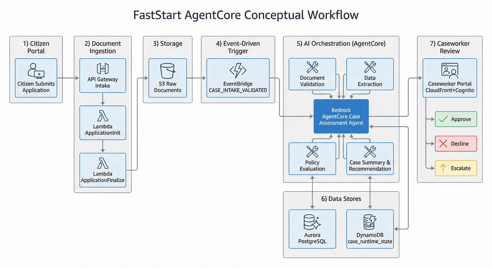

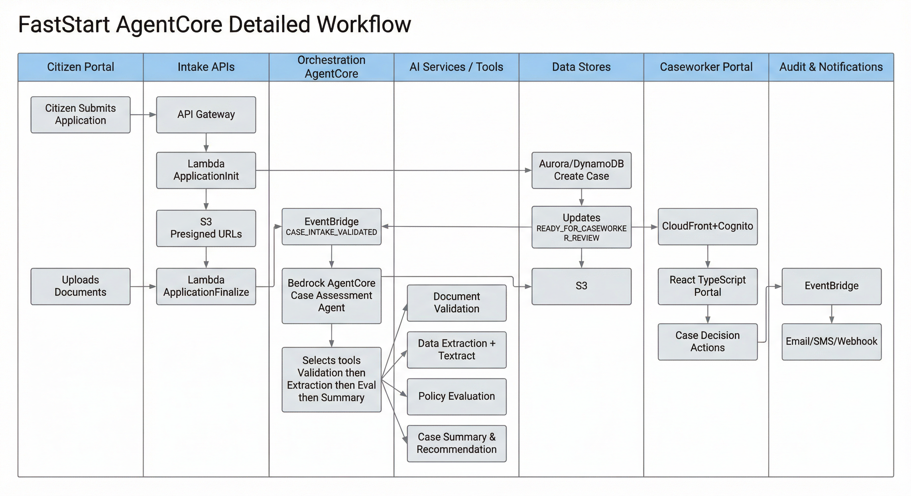

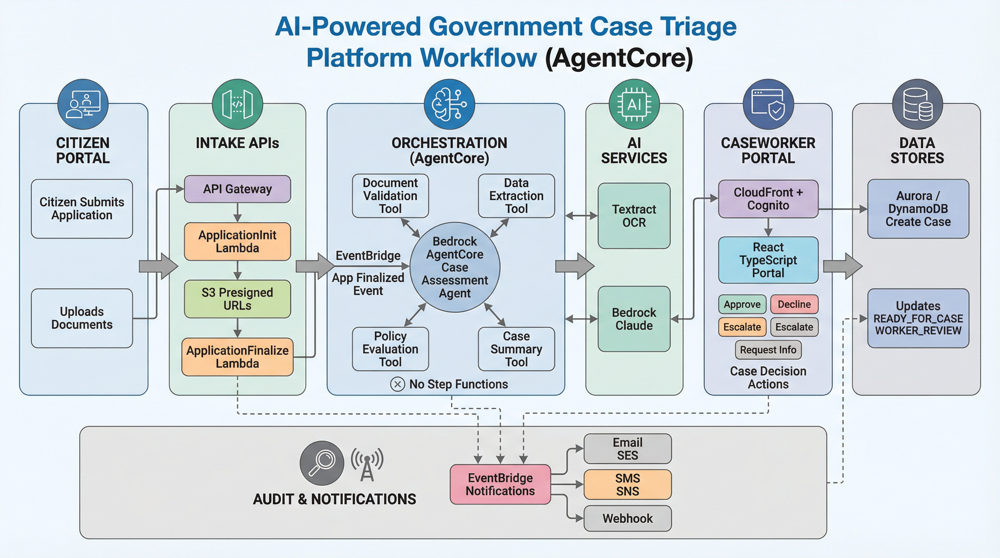


---

### 5.2 Step 1 – Document Ingestion

#### 5.2.1 Application initialisation – `POST /applications/init`

**Input (example):**

```json
{
  "caseId": "HF-2025-000123",
  "orgId": "councilA",
  "caseType": "hardship-fund",
  "submissionType": "NEW",
  "applicant": {
    "firstName": "John",
    "lastName": "Smith",
    "dob": "1985-03-22",
    "nationalInsurance": "AB123456C"
  },
  "documents-to-upload": [
    { "fileName": "passport.pdf", "documentType": "passport", "version": 1 },
    { "fileName": "payslip_jan.pdf", "documentType": "payslip", "month": "January-2026", "version": 1 }
  ],
  "submittedAt": "2026-02-06T15:00:00Z"
}
```

**Lambda: ApplicationInitLambda**

1. Schema validation (required fields, submission type)
2. Policy resolution from Aurora (which policy version applies)
3. Semantic validation (org exists, case type allowed)
4. Case creation (generate caseId if missing, lock policy version)
5. State initialisation: Aurora + DynamoDB
6. Presigned S3 URLs for documents

**Policy version immutability:** The policy version resolved and locked at init MUST remain immutable for the lifetime of the case. No subsequent operation (including re-submission or update) may change the policy version associated with a case once it has been set.

**Submission type handling (NEW vs UPDATE):**

- `NEW`: Creates a new case with `applicationVersion = 1`. If a case with the same `caseId` already exists and is in a non-terminal state, the init request MUST be rejected (duplicate prevention).
- `UPDATE`: Increments the `applicationVersion` for an existing `caseId`; the originally locked `policyVersion` MUST be preserved. The case state MUST be validated before accepting an update (e.g., case must not be in a terminal decision state).

**Database writes:**

- **DynamoDB** `case_runtime_state`: caseId, orgId, caseType, policyVersion, applicationVersion, status, timestamps
- **Aurora** `cases`: case_id, org_id, case_type, policy_version, submission_type, applicant_reference, timestamps

**Output to upstream:**

```json
{
  "caseId": "HF-2025-000123",
  "policyVersion": 3,
  "requiredDocuments": [...],
  "uploadUrls": { ... }
}
```

#### 5.2.2 Document upload (direct to S3)

- Upstream uploads documents using the provided presigned URLs
- **Bucket naming:** `<org-id>-<case-type>-applicant-intake-s3-<env>`
- **Folder structure:** `s3://.../<org-id>/<case-type>/<case-id>/documents/<document-type>-<timestamp>-v<version>.<ext>`
- Manifest.json must be included where required

#### 5.2.3 Intake finalisation – `POST /applications/complete`

**Input:**

```json
{
  "caseId": "HF-2025-000123"
}
```

**Lambda: ApplicationFinalizeLambda**

1. Load case context (policy, required documents from `policy_documents`)
2. Inspect S3 uploads against policy:
   - Validate `manifest.json` presence where required by the policy
   - Validate each required document type is present per `policy_documents.mandatory`
   - Validate document version count does not exceed `policy_documents.max_versions`
   - Validate lookback coverage against `policy_documents.lookback_period_months` (e.g., 3 months of payslips)
   - Validate document MIME types against `policy_documents.accepted_formats` (policy-driven, not a static allowlist)
3. Technical sanity checks (file size limits, MIME type consistency with file extension)
4. Persist metadata to Aurora
5. Update DynamoDB case state → **INTAKE_VALIDATED**
6. Emit EventBridge event for AI orchestration

**Database updates:**

- DynamoDB: status → INTAKE_VALIDATED
- Aurora: `case_documents` (case_id, document_type, s3_key, version, timestamp)

---

### 5.3 Step 2 – Event-Driven Triggering

- **Trigger:** Successful intake validation → EventBridge emits **CASE_INTAKE_VALIDATED**
- **Event structure:**

```json
{
  "source": "case.intake",
  "detail-type": "CASE_INTAKE_VALIDATED",
  "detail": { ... }
}
```

- EventBridge rule filters by detail-type → starts AI orchestration (Bedrock AgentCore)
- Loose coupling, fan-out, observability

**Minimum event `detail` payload:** The `detail` object MUST contain the mandatory fields defined in **§12.1** (EventBridge Event Schema decision): `caseId`, `correlationId`, `orgId`, `policyVersion`, `stage`, `timestamp`, and `schemaVersion`. See **Appendix H** for JSON Schema definitions.

---

### 5.4 Step 3 – Policy-Governed AI Orchestration (Agent Core)

**AgentCore-first note:** Orchestration MUST be executed by **AWS Bedrock AgentCore** (optionally via the **Strands Agents SDK** or equivalent AgentCore runtime). Deterministic policy logic remains outside the agent in governed tool contracts. Step Functions (not used for AI orchestration) must not be used for AI sequencing.

- **Agent Core** orchestrates deterministic, multi-stage, policy-governed workflows
- Stateless agents; databases hold persistent state
- **Human decision required** – no automated approvals
- Uses **Amazon Bedrock Agent Core**, **Amazon Textract** (document introspection), and Bedrock reasoning (classification)

| Agent | Purpose | Inputs | Outputs | Status |
|-------|---------|--------|---------|--------|
| 1. Document validation | Validate technical correctness | S3 docs, policy | Valid/invalid, metadata | DOCS_TECHNICALLY_VALIDATED |
| 2. Data extraction | Extract structured fields | Validated docs, policy | JSON fields, confidence | DATA_EXTRACTED |
| 3. Policy evaluation | Check rules, eligibility | Extracted data, policy | Rule results, explanations | POLICY_VALIDATED |
| 4. Case summary & recommendation | Synthesise case summary | All prior outputs | Human-readable summary + recommendation | SUMMARY_READY |
| 5. Mark ready for review | Release workflow lock, emit readiness event | Summary outputs, case state | Lock released, CASE_AI_READY_FOR_REVIEW emitted (idempotent) | READY_FOR_CASEWORKER_REVIEW |

#### Tool #5 – Mark Ready: Validation and Transition Rules

Tool #5 ("Mark ready for review") MUST enforce the following:

1. **Pre-condition:** Validate that the case is in status `SUMMARY_READY` before attempting any transition. If not, the tool MUST reject the invocation or treat it as a no-op (idempotent).
2. **Aurora status:** Set case status to `READY_FOR_CASEWORKER_REVIEW` in Aurora.
3. **DynamoDB update:** Update `case_runtime_state.current_stage`, `status`, and `updated_at`.
4. **Execution record:** Write an `agent_executions` entry (as required of all tools by §5.9.3).
5. **Event emission:** Emit `CASE_AI_READY_FOR_REVIEW` via EventBridge.
6. **Lock release:** Release any workflow lock held in DynamoDB.
7. **Idempotency (strict):** Repeated invocations MUST NOT duplicate writes, events, or lock releases. If the case is already `READY_FOR_CASEWORKER_REVIEW`, the tool is a no-op (§5.8, §5.9.6).

#### Policy Separation in Agent Context

Per §3.1 ("No policy logic in code; policies loaded from versioned configuration") and the AgentCore-first note above:

- **No policy logic in AgentCore prompts:** Agent system prompts, instructions, and any text injected into the LLM context MUST NOT contain policy rules, thresholds, eligibility criteria, or fairness constraints.
- **No policy logic in agent instructions:** Agent instruction templates MUST NOT embed or hard-code policy content.
- **Tools reference Aurora directly:** Deterministic tools MUST read policy data from Aurora policy tables (`policies`, `policy_rules`, `policy_fairness_constraints`, etc.) at execution time — never from embedded constants, prompt text, or cached YAML/S3 files.

**Failure handling:**

- Each agent handles failures explicitly; stops or flags for review
- Partial outputs preserved
- Workflow resumable from last successful **Aurora status checkpoint**; DynamoDB provides runtime lock/attempt state only.

---

### 5.5 Step 4 – Caseworker Review & Human Decision

- Caseworker logs in via portal (Cognito SSO), sees list of cases assigned
- Selects case → sees case information, documents, AI summary and recommendation
- **Actions:** Approve, Decline, Pending, Escalate, or send email to citizen (e.g. request more info)
- AI outputs are **read-only**; caseworker takes final action
- **Entry criteria:** status READY_FOR_CASEWORKER_REVIEW

| Sub-area | Description |
|----------|-------------|
| Authentication & authorisation | Cognito SSO, IAM, Aurora role mapping |
| Case listing & notification | Read-only display of relevant cases, status, AI completion |
| Individual case view | Read-only: applicant data, documents, extracted fields, policy evaluation, AI summary |
| Human decision stage | Actions: Approve, Decline, Pending, Escalate → writes Aurora + DynamoDB (decision, justification, timestamp) |
| Escalation workflow | Senior review if ambiguous; original decision locked, history preserved (see below) |
| Notification & downstream | EventBridge / SES / optional downstream notifications |
| Audit & immutability | AI outputs frozen, policy version preserved, all actions timestamped and traceable |

**Escalation immutability and history requirements:**

- The original caseworker decision MUST be preserved immutably in `case_decisions`. An escalation MUST NOT mutate or overwrite the original decision record.
- A manager resolution MUST create a **new** `case_decisions` record (with its own `decision_id`, `decided_by`, `justification`, `decided_at`), preserving the full chain of decisions for the case.
- Managers MUST be able to view escalation history: all prior decisions for the case, including the original caseworker decision and any prior escalation decisions.
- The `case_decisions` table supports multiple records per `case_id`, enabling a complete decision audit trail.

**Optional AI-drafted email to citizen:**

- Caseworkers MAY use the portal to send an email to the citizen (e.g., request more information) as noted in Screen 4.
- If used: Bedrock drafts the email content; the caseworker reviews and confirms before sending.
- The email MUST be sent via **SES** (or equivalent managed email service).
- Each sent email MUST be recorded in the `audit_logs` table (entity_type, entity_id, action=EMAIL_SENT, performed_by, timestamp).
- The email content (or a reference to it) MUST be persisted in Aurora for traceability.
- The system MUST NOT send any email without explicit caseworker confirmation.

---

### 5.6 Step 5 – Policy Customisation & Runtime Usage

**Policy definition & storage**

- YAML-based (or JSON) human-friendly files
- Uploaded via **Admin UI** in caseworker portal → **S3** (e.g. `policy-definition-bucket-prd`)
- Versioned; old versions immutable

**Processing flow**

1. Upload → S3 → ObjectCreated → EventBridge → Policy Lambda
2. Validation (two stages):
   - **Schema validation:** Structural correctness of the uploaded policy file (required fields, valid data types, well-formed YAML/JSON).
   - **Semantic validation:** Logical consistency — no contradictory rules (e.g., conflicting thresholds for the same field), valid references between policy sections.
   - **Fairness constraint enforcement:** Validate against `policy_fairness_constraints` table — prohibited attributes must not appear as decision criteria in `policy_rules` at `strict` enforcement level.
3. Normalisation → machine-readable canonical form; normalised rules MUST produce a deterministic evaluation order to ensure consistent outcomes across executions.
4. Persist in Aurora → runtime policy execution
5. Activation → policy available for intake workflows

**Policy use at runtime**

- Intake Lambda resolves **active policy version**
- Agents **read from Aurora**; never directly from YAML or S3 at execution time
- Caseworker UI shows version, rule outcomes, fairness guarantees

**Aurora tables:** `policies`, `policy_documents`, `policy_extraction_fields`, `policy_rules`, `policy_fairness_constraints`

*Sample YAML policy structure: TBD (Appendix).*

---

### 5.7 Step 6 – Decision Publication / Retrieval

The **Citizen Portal / Upstream system** polls for the decision.

**Endpoint:** `GET /applications/{caseId}/decision`

**Lambda: GetDecisionLambda**

- Validate request
- Authorise org access
- Retrieve decision from Aurora (`case_decisions`)
- Return structured response

**Example response:**

```json
{
  "caseId": "HF-2025-000123",
  "decision": "APPROVED",
  "reason": "Household income below hardship threshold",
  "confidence": 0.87,
  "policyVersion": 3,
  "decidedAt": "2026-02-10T14:32:00Z"
}
```

---

### 5.8 Workflow Consistency & Recovery

**Design principles**

1. Stateless compute
2. Externalised state (DynamoDB + Aurora)
3. Idempotent steps
4. Resume from last successful checkpoint
5. All failures observable and auditable

**Recovery services**

- SQS + DLQs (retry isolation)
- CloudWatch (monitoring/alerts)
- Lambda (stateless, retry-safe)
- DynamoDB (runtime state)
- Aurora (authoritative metadata)

**Failure handling**

- Partial processing tracked; retry from checkpoint
- DLQs capture permanent failures; manual replay possible
- Multi-AZ Aurora, Lambda auto-retry, Textract retries for resilience

---


---

### 5.9 Ops Observability & Operational Recovery

The system MUST support operational detection, diagnosis, and safe recovery of cases that stop progressing due to either business validation blocks or infrastructure/runtime failures.

#### 5.9.1 Definitions: STUCK, FAILED (Infrastructure), BLOCKED (Business)

A case is **STUCK** when:
- The case is in a **non-terminal** status (e.g. `INTAKE_VALIDATED`, `DOCS_TECHNICALLY_VALIDATED`, `DATA_EXTRACTED`, `POLICY_VALIDATED`, `SUMMARY_READY`), AND
- The case has not advanced to the next valid status within the **stage SLA threshold**, measured using `updated_at` (or an equivalent “last progressed” timestamp) in Aurora.

A case is **FAILED (Infrastructure)** when:
- A tool invocation fails due to infrastructure/runtime conditions (timeouts, throttling, dependency outage, service errors), AND
- The case does not progress beyond the current stage after the configured retry strategy.

A case is **BLOCKED (Business)** when:
- A mandatory document/field/policy requirement fails, and progression is intentionally halted until action is taken (e.g. missing mandatory document, required field extraction failure).

#### 5.9.2 Stage SLA Thresholds

The system MUST define and publish stage-level SLA thresholds (time-to-progress) for:
- Validation
- Data Extraction
- Policy Evaluation
- Recommendation/Summary
- Mark Ready / readiness event emission

These thresholds MUST be used for stuck-case detection and operational alerting.

#### 5.9.3 Tool-Level Failure Recording (Per Case)

Each deterministic tool invocation MUST record, in a durable and queryable form (e.g. Aurora execution/audit tables and/or structured logs linked by correlation ID), at minimum:

- `caseId`
- `tool_name`
- `tool_attempt_number` (or equivalent retry count)
- `tool_started_at`
- `tool_ended_at`
- `tool_outcome` (`SUCCESS`, `FAILURE`, `RETRYING`, `BLOCKED`)
- `last_error_code` (when failure occurs; standardized categories recommended)
- `last_error_time`
- `last_error_summary` (short, non-PII)

The system MUST ensure Ops can identify, for any stuck/failed case: the last tool executed, the most recent error code/time, and whether the failure is infrastructure vs business-blocking.

#### 5.9.4 Ops Reporting: Stuck Case View

The system MUST provide an operational view (query/report/dashboard) listing STUCK cases, including:
- current `status` (Aurora) and time-in-status
- last tool executed + last error code/time
- runtime lock state (if applicable)

The view MUST support filtering by status/stage, organisation/orgId (where relevant), and time window.

#### 5.9.5 Alerting

The system MUST support alerting for:
- Tool error-rate spikes (per tool)
- Tool timeout spikes and duration anomalies
- AgentCore orchestration/session failures
- Retry exhaustion / repeated failures for the same case+tool
- DLQ growth (if queues/DLQs are used)
- EventBridge delivery/dispatch failures for critical events (e.g. readiness event)

Alerts MUST include correlation identifiers and case identifiers sufficient to locate impacted cases.

#### 5.9.6 Recovery and Replay

The system MUST support safe recovery by ensuring state transitions are idempotent, tools validate current status before applying transitions, and repeated invocations do not duplicate side effects (writes/events).

The system MAY support one or more manual replay mechanisms for Ops (e.g. re-emitting the trigger event for a case, invoking a resume endpoint, or re-running tool invocations). Any replay MUST resume from the last durable checkpoint based on Aurora status and MUST remain idempotent.


## 6. Application Architecture

### 6.1 Architecture Summary

Modular, cloud-native, event-driven design on AWS.

### 6.2 Frontend Architecture (Caseworker Portal)

- **Stack:** React 18 + TypeScript, Next.js 14 (SSG/ISR)
- **Rendering:** User-facing portal pages MUST use SSG (Static Site Generation) or ISR (Incremental Static Regeneration) where applicable. Pages with primarily static content (login, settings, FAQ, AI Guide) SHOULD use SSG. Pages with dynamic case data (case list, homepage dashboards) MUST use ISR with appropriate revalidation intervals to balance freshness and performance.
- **Deployment:** AWS Amplify (hosting, APIs, auth, backend environments)
- **Access:** Amazon Cognito (SSO, role-based access for Caseworkers, Managers, Administrators)

**Main screens**

| # | Screen | Description |
|---|--------|-------------|
| 1 | Login | Secure SSO; role-based access |
| 2 | Homepage | Totals, case status, priority distribution |
| 3 | Case management | List of all cases |
| 4 | Individual case | Applicant details, AI analysis, documents, notes, risk assessment; Approve / Decline / Escalate; optional “send status update email” |
| 5 | Notifications | Case notifications; toggles in settings for notification types |
| 6 | Settings | Profile, notifications, display, FAQ, support, AI Guide |
| 7 | Escalated cases | Managers only |
| 8 | User management | Administrators only – create, delete, update users |
| 9 | Policy management | Administrators – manage policies used by AI agent |

**Login page**

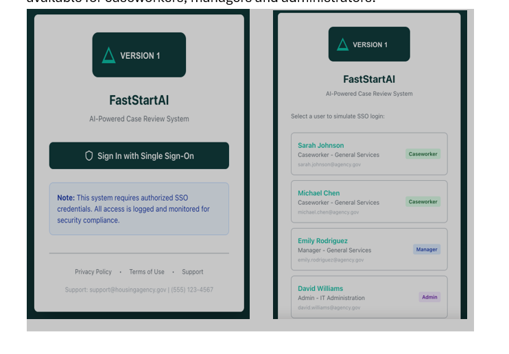

**Homepage**

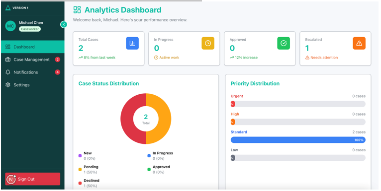

**The Case Management Screen**

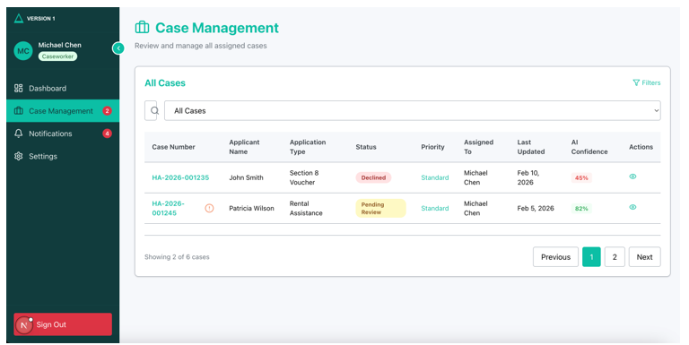

**Individual case screen**

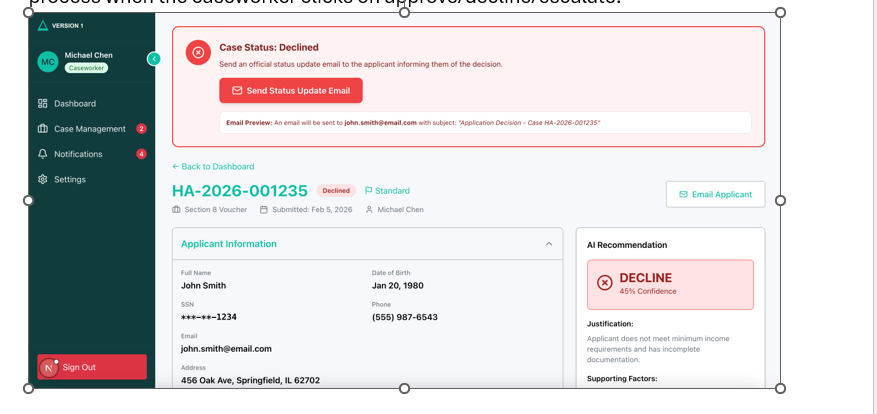
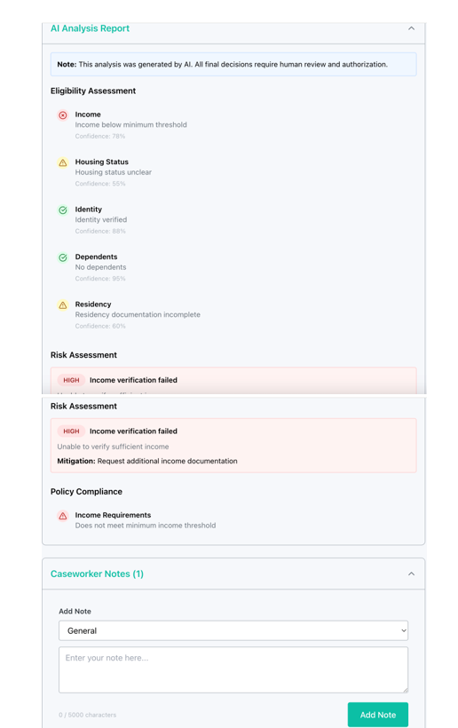
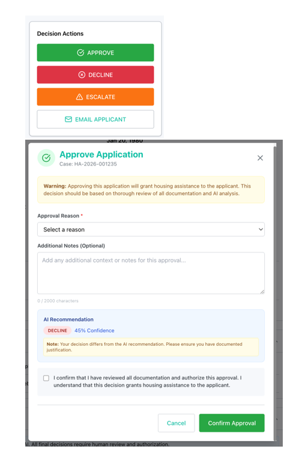
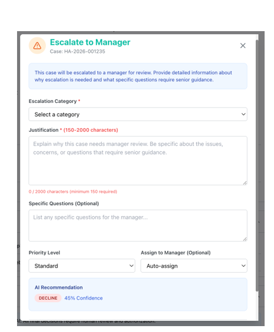

**Notifications**

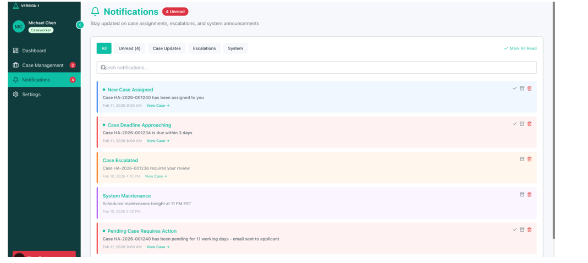

**Settings**

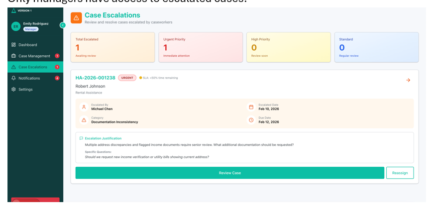

**Escalated Cases**

*(Add screenshot when available.)*

**User Management**

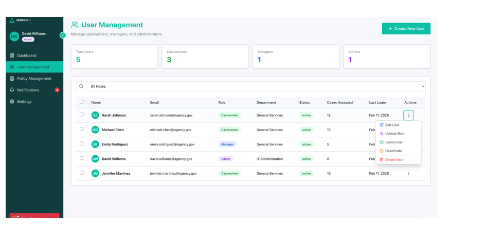

**Policy Management**

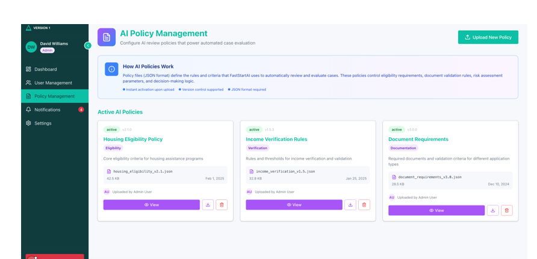

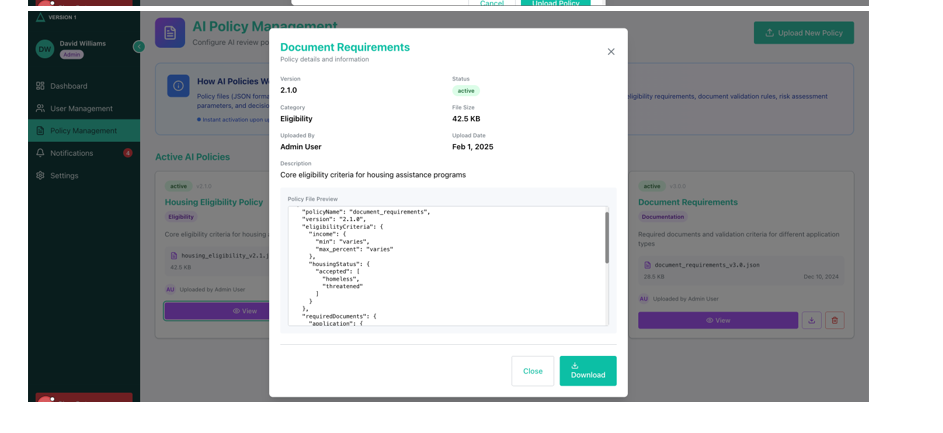

### 6.3 Backend Architecture

**Categories**

1. **Application intake, Agent Core / AI processing, decision retrieval** – as in section 5
2. **APIs that power the Caseworker Portal**

**Caseworker flows**

| Flow | Description |
|------|-------------|
| Login | SSO via Cognito (e.g. Azure AD / Okta); JWT with role claims |
| Dashboard | API Gateway → Lambda → Aurora (cases by `assigned_to`), stats, DynamoDB notifications |
| Case list | JWT → user_id → Aurora: cases by status (ASSIGNED, UNASSIGNED), pagination. The `cases.assigned_to` attribute determines ownership. Caseworkers see cases assigned to them; unassigned cases are visible based on role permissions. |
| Case details | Lambda: case metadata (Aurora), AI analysis (Aurora as source of truth; DynamoDB optional cache/runtime pointers), documents (S3 presigned URLs) |
| Decision (Approve / Decline / Escalate) | Bedrock drafts email if used; Lambda updates Aurora status; audit log; SES; EventBridge; DynamoDB notifications |
| Notes | Caseworker notes MUST be persisted in Aurora (`case_notes` table). Notes are append-only (immutable once created): each note is a distinct record with `performed_by` and `created_at`. Notes MUST NOT be edited or deleted after creation. See Notes API parity below. |
| Notifications & profile | Notifications from DynamoDB (`user_notifications` table); profile/image in S3. Notifications MUST support `read`/`unread` status. Notification preferences (enable/disable per notification type) MUST be stored per user. |

**Notes API parity:**

- Notes are created via a portal API action that INSERTs a new `case_notes` record (append-only).
- The case details API returns notes ordered by `created_at`.
- Each note creation writes an `audit_logs` entry with action=NOTE_ADDED (`performed_by`, `timestamp`).
- Access is controlled by role and assignment rules (only users with access to the case may add or view notes).

**Case assignment:**

- The `cases` table MUST include an `assigned_to` attribute (FK to user/caseworker identifier).
- Cases transition between UNASSIGNED and ASSIGNED states via assignment actions.
- Assignment, unassignment, and reassignment actions MUST each write an `audit_logs` entry (action=CASE_ASSIGNED / CASE_UNASSIGNED / CASE_REASSIGNED, performed_by, timestamp).

**Admin flows**

- Login: same Cognito SSO, admin RBAC
- Dashboard: case metrics, user stats, system health (CloudWatch)
- User management: create, activate, deactivate, soft delete; Aurora + Cognito; audit log. Each user management action MUST write an `audit_logs` entry.
- Policy configuration: upload JSON/YAML, validate, version in Aurora

**Manager flows**

- Dashboard & case access; escalation visibility
- Escalation view: escalations by status, joined with case details; escalation history (all prior decisions for the case)
- Escalation review: caseworker notes, case history, AI risk insights
- Resolution: manager decision → new `case_decisions` record → Aurora → audit → EventBridge → notifications. The original caseworker decision MUST NOT be mutated (see §5.5).

### 6.4 Database Architecture

**Authoritative vs runtime state:** Aurora PostgreSQL is the **system of record** for policies, cases, extracted fields, rule outcomes, agent outputs, recommendations, decisions, and audit logs. DynamoDB stores **runtime orchestration state only** (e.g., current status, lock owner/expiry, attempt counts, last tool executed). UI-visible “AI analysis” must be derivable from Aurora records; DynamoDB may cache pointers or latest snapshots but must not be the sole source of truth.


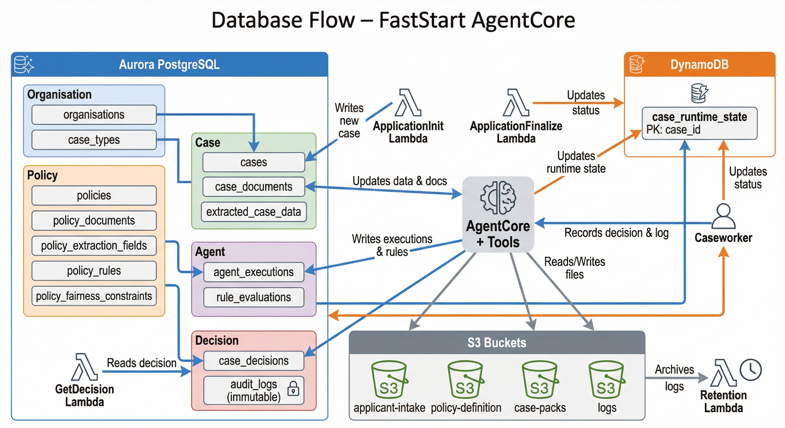

**Dual-database model**

- **Amazon Aurora PostgreSQL** – system of record: policies, cases, document metadata, extracted data, rule evaluations, agent outputs, human decisions, audit trail
- **Amazon DynamoDB** – runtime workflow state only: stage, status, retry, locks (no policy or decision data)

**Table groups** (detailed in section 7)

1. Organisation & case setup (Aurora)
2. Policy configuration – versioned (Aurora)
3. Case & application (Aurora)
4. Agent processing (Aurora)
5. Human decision & audit (Aurora)
6. Runtime workflow (DynamoDB)

**Aurora requirements**

- IAM-based access only (no password)
- Encrypted in transit
- Automated backups, PITR
- Error/general/slow query logs to CloudWatch
- Enhanced monitoring and Performance Insights
- CloudTrail integration
- Deletion protection enabled

**Retention**

- EventBridge rule triggers when Case & Application data is **5 years old** → Lambda deletes that data (as per policy).

---

## 7. Database Tables

### 7.1 Aurora PostgreSQL

**Common requirements for all tables:** KMS encryption, PITR, CloudTrail data events, tags (Environment, Owner=PublicSectorCaseTriage, Purpose=CaseManagement, Compliance=ISO27001,FedRAMP), **no PII in logs**.

#### 1. Organisation & case setup

| Table | Primary key | Required attributes |
|-------|-------------|---------------------|
| **organisations** | organisation_id (String) | name, status (active/suspended), created_at |
| **case_types** | case_type_id (String) | organisation_id (FK), name, status |

#### 2. Policy configuration (versioned)

| Table | Primary key | Required attributes |
|-------|-------------|---------------------|
| **policies** | policy_id (String) | organisation_id (FK), case_type_id (FK), version, status (draft/active/retired), effective_from, created_at |
| **policy_documents** | policy_document_id (String) | policy_id (FK), document_type, mandatory, accepted_formats, max_versions, lookback_period_months (optional) |
| **policy_extraction_fields** | extraction_field_id (String) | policy_id (FK), document_type, field_name, datatype |
| **policy_rules** | rule_id (String) | policy_id (FK), field_name, operator (<, <=, >, >=, =), comparison_value, description |
| **policy_fairness_constraints** | fairness_id (String) | policy_id (FK), prohibited_attribute, enforcement_level (strict/advisory) |

#### 3. Case & application

| Table | Primary key | Required attributes |
|-------|-------------|---------------------|
| **cases** | case_id (String) | organisation_id (FK), case_type_id (FK), policy_id (FK), policy_version, submission_type, applicant_reference, assigned_to (nullable, FK to user identifier), status, created_at, updated_at, intake_completed_at |
| **case_documents** | case_document_id (String) | case_id (FK), document_type, s3_object_path, version, upload_timestamp |
| **extracted_case_data** | extracted_data_id (String) | case_id (FK), field_name, value, confidence_score |

#### 4. Agent processing

| Table | Primary key | Required attributes |
|-------|-------------|---------------------|
| **agent_executions** | agent_execution_id (String) | case_id (FK), correlation_id, tool_name, tool_attempt_number, tool_started_at, tool_ended_at, tool_outcome (SUCCESS/FAILURE/RETRYING/BLOCKED), last_error_code (nullable), last_error_time (nullable), last_error_summary (nullable, non-PII) |
| **rule_evaluations** | evaluation_id (String) | case_id (FK), rule_id (FK), result (pass/fail/conditional), explanation |

#### 5. Human decision, notes & audit

| Table | Primary key | Required attributes |
|-------|-------------|---------------------|
| **case_decisions** | decision_id (String) | case_id (FK), decision, decided_by, justification, decided_at |
| **case_notes** | note_id (String) | case_id (FK), note_text, performed_by, created_at — **append-only (immutable once created)** |
| **audit_logs** | audit_id (String) | entity_type, entity_id, action, performed_by, timestamp — **immutable** |

**`case_notes` requirements:** Notes are created by caseworkers or managers on individual cases (§6.2 Screen 4, §6.3). Each note is a separate, immutable record. Notes MUST NOT be edited or deleted after creation. The `performed_by` field identifies the author; `created_at` provides the timestamp.

### 7.2 DynamoDB

| Table | Primary key | Required attributes |
|-------|-------------|---------------------|
| **case_runtime_state** | case_id (String) | orgId, caseType, policyVersion, applicationVersion, current_stage (intake/validation/agent/review), status, lock_owner, lock_expiry, attempt_count, last_tool_executed, updated_at, created_at |
| **user_notifications** | notification_id (String) | user_id (String), case_id (optional), notification_type, message, status (unread/read), created_at |
| **notification_preferences** | user_id (String) | preferences (map of notification_type → enabled/disabled), updated_at |

**`user_notifications` requirements:** Notifications are created by EventBridge-triggered Lambdas (e.g., on case status changes, escalations, assignments) and stored in DynamoDB (§6.3 Caseworker flows). The UI MUST allow users to mark notifications as read/unread. Notification preferences (per `notification_preferences` table) control which notification types a user receives. Preferences MUST be editable from the Settings screen (§6.2 Screen 6).

**Requirements:** KMS encryption, PITR, CloudTrail data events, same tags; **no PII stored or logged**; runtime only (no historical records).

---

## 8. S3 Data Handling & Security

### 8.1 Data handling rules

**Raw documents (applicant uploads)**

- PDF, DOCX, ID proofs, bank statements, utility bills, letters
- Stored in raw-documents bucket (Standard)

**Glacier (after case closure)**

- Closed case raw documents
- Final case packs / decision bundles (PDF summaries, decision letters)

**Lifecycle**

The following lifecycle applies to **both** raw applicant documents **and** final case packs / decision bundles:

- Day 0 → S3 Standard  
- Day 30 → S3 Standard-IA  
- Case closed +30–90 days → Glacier Flexible Retrieval  
- Retention 5 years → then delete

Decision bundles (generated after human decision) MUST follow the same lifecycle policy. They MUST be stored in a designated S3 prefix or bucket and tagged for lifecycle management.

### 8.2 S3 security requirements

- Block all public access
- Encryption at rest (AWS KMS)
- Deny non-HTTPS (`aws:SecureTransport = false`)
- Disable ACLs
- IAM restricted to: **AI-Agent-Role** (read-only raw), **Caseworker-Review-Role** (read-only raw), **Admin-Role** (full)
- Versioning enabled
- Object lock (WORM) in Governance mode
- Server access logging to dedicated logging bucket
- S3 VPC endpoint where applicable

---

## 9. Infrastructure Architecture
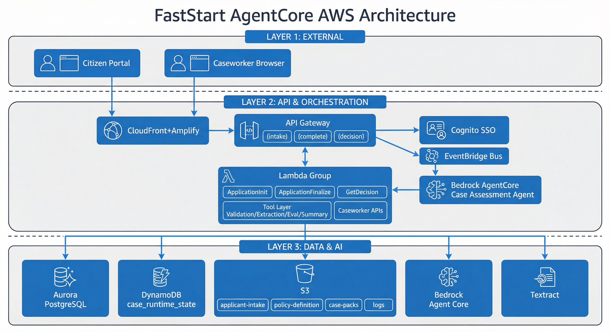

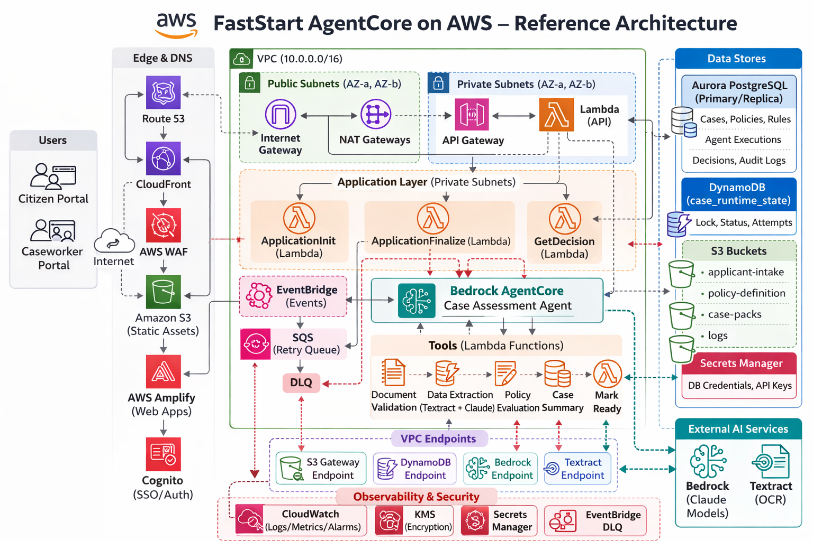

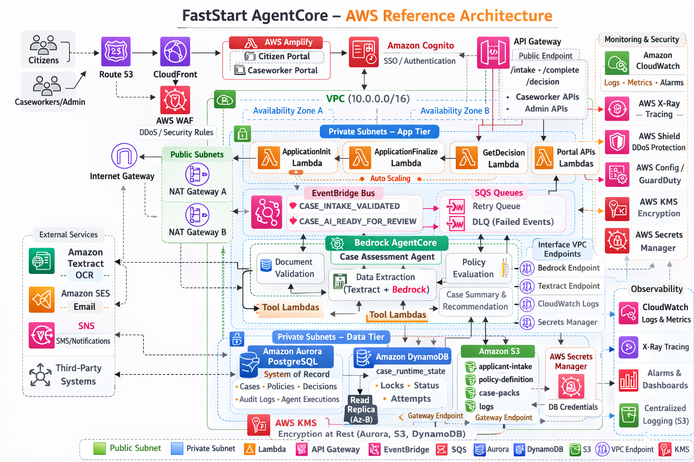

- **IAC** – Terraform; CI/CD for all components needed
- **VPC** – segmented; private subnets for application and data; NAT for outbound
- **Public access** – Frontend and API via CloudFront and API Gateway; WAF and Shield
- **DNS & TLS** – Route 53, ACM (custom domains, HTTPS)
- **Caseworker portal** – Amplify + CloudFront
- **Auth** – Cognito with enterprise IdP (e.g. Azure AD, Okta), SSO, RBAC
- **Compute** – Lambda (intake, validation, decision, portal APIs); Bedrock AgentCore; EventBridge; SQS + DLQs
- **AI** – Bedrock Agent Core, Textract
- **Data** – Aurora PostgreSQL (Multi-AZ), DynamoDB (encryption, PITR), S3 (KMS, versioning, object lock, lifecycle)
- **Security** – IAM least privilege, KMS, TLS, Secrets Manager; VPC endpoints for S3, DynamoDB, Bedrock, etc.
- **Observability** – CloudWatch, CloudTrail, Aurora Performance Insights
- **HA & DR** – Multi-AZ, automated backups, PITR, versioned S3

**Network security requirements (detailed):**

| Requirement | Detail |
|-------------|--------|
| **WAF** | AWS WAF MUST be deployed in front of API Gateway and CloudFront to protect against common web exploits (SQL injection, XSS, request flooding). |
| **AWS Shield** | AWS Shield (Standard at minimum) MUST be enabled for DDoS protection on public-facing endpoints. |
| **VPC segmentation** | Application and data resources MUST reside in **private subnets**. Public subnets are limited to load balancers / NAT gateways / CloudFront origins. |
| **NAT** | Outbound internet access from private subnets MUST route through NAT gateways; no direct internet ingress to application or data subnets. |
| **VPC endpoints** | VPC endpoints MUST be provisioned for AWS services accessed from private subnets: S3 (gateway endpoint), DynamoDB (gateway endpoint), Bedrock, SQS, EventBridge, Secrets Manager, CloudWatch Logs (interface endpoints). |

---

## 10. Naming Conventions

| Placeholder | Values / format |
|-------------|-----------------|
| `<env>` | `dev` \| `tst` \| `prd` |
| `<org-id>` | Short, lowercase, hyphenated (e.g. `council-a`) |
| `<case-type>` | Short slug (e.g. `hardship-fund`, `housing-benefit`) |
| **App prefix** | **PS-FastStart** (or `PS` or `ct` in code) |

**Examples**

- S3 bucket: `<org-id>-<case-type>-applicant-intake-s3-<env>`
- Lambda: `FastStart-<env>-application-init`, `FastStart-<env>-get-decision`, etc.

---

## 11. Ambiguities / Open Questions

Items §11.1–§11.5 have been **closed** by the v1.2.1 Decision Closure Addendum (§12). They are retained here for traceability with a CLOSED status. Remaining open items follow.

### 11.1 EventBridge Full Event Contract — **CLOSED**

Decided in **§12.1**. Full mandatory `detail` schema defined with versioned JSON Schema validation.

### 11.2 Case Assignment Rules — **CLOSED**

Decided in **§12.2**. Manual assignment + concurrency-safe self-claim at launch; auto-assignment deferred.

### 11.3 ISR Revalidation Intervals — **CLOSED**

Decided in **§12.4**. Explicit defaults per page type with environment-configurable overrides and mutation-triggered refresh.

### 11.4 SES Email Triggers for Notifications — **CLOSED**

Decided in **§12.5**. Optional secondary SES channel with org-level enablement, user preferences, and non-blocking delivery.

### 11.5 Risk Assessment Storage Model — **CLOSED**

Decided in **§12.3**. Dedicated `case_ai_summaries` table with JSONB risk assessment; 1:1 UI parity.

### 11.6 Strands Agents SDK (unchanged)

v1.2 states "optionally via Strands Agents SDK or equivalent." Whether "equivalent" includes any Bedrock AgentCore-compatible runtime is an implementation choice.

### 11.7 Manual Replay Mechanism (unchanged)

v1.2 says the system MAY support replay and lists examples; which mechanism(s) to implement is a project decision.

### 11.8 Stage SLA Threshold Values (unchanged)

v1.2 requires that thresholds be defined and published but does not specify numeric values; those are operational/contract decisions.

### 11.9 AI Email API Endpoint Schema (unchanged)

v1.2 defines email audit and SES requirements (§5.5) but does not specify a dedicated API endpoint schema for email drafting. Whether the email drafting uses an explicit `/email/draft` endpoint or is embedded in the decision flow is an implementation choice.

---

## 12. v1.2.1 Decision Closure Addendum

This addendum formally closes the five open questions from §11.1–§11.5. Each decision is **binding** for implementation. Corresponding §11 entries are superseded.

### 12.1 Decision: EventBridge Event Schema

**Status:** CLOSED — supersedes §11.1.

All EventBridge events emitted by the system MUST conform to a versioned JSON Schema. The `detail` payload MUST contain:

| Field | Type | Required | Description |
|-------|------|----------|-------------|
| `caseId` | string | MUST | Case identifier |
| `correlationId` | string (UUID) | MUST | End-to-end traceability ID; propagated across API → EventBridge → AgentCore → logs |
| `orgId` | string | MUST | Organisation identifier |
| `policyVersion` | integer | MUST | Locked policy version for this case |
| `stage` | string | MUST | Processing stage at time of emission |
| `timestamp` | string (ISO 8601) | MUST | Event emission timestamp (UTC) |
| `schemaVersion` | string (semver) | MUST | Schema version (e.g. `1.0.0`) |

**Validation expectations:**

- **Producers** MUST validate outbound events against the registered JSON Schema before emission. Validation failure MUST prevent emission and log an error with correlation ID.
- **Consumers** MUST validate inbound events and route schema-invalid events to a dedicated DLQ with the original payload preserved.
- **Contract tests** MUST exist in CI/CD to verify event schemas remain backward-compatible across deployments.
- **Versioning:** Schema versions follow semver. Breaking changes increment the major version and require coordinated producer/consumer deployment.

See Appendix H for JSON Schema definitions.

### 12.2 Decision: Case Assignment Mode + Access Rules

**Status:** CLOSED — supersedes §11.2.

The system MUST support two assignment modes at launch:

1. **Manual assignment** — A user with Manager or Administrator role assigns a case to a specific caseworker by setting `cases.assigned_to`.
2. **Self-claim** — A caseworker claims an unassigned case. The claim MUST be concurrency-safe: single-winner via atomic conditional update (`UPDATE cases SET assigned_to = :userId, updated_at = NOW() WHERE case_id = :caseId AND assigned_to IS NULL`). If another user has already claimed, return HTTP **409 Conflict**.

Auto-assignment is deferred (MAY be added as a future configurable option).

**Role-based visibility:**

| Role | Visible cases | Can assign | Can self-claim | Can unassign/reassign |
|------|---------------|------------|----------------|-----------------------|
| Caseworker | Own assigned + unassigned in own org | No | Yes (unassigned only) | No |
| Manager | All cases in own org | Yes | Yes | Yes |
| Administrator | All cases across orgs | Yes | No | Yes |

**Audit:** Every assignment change MUST write an `audit_logs` entry. Self-claim uses action `CASE_CLAIMED`.

### 12.3 Decision: Risk Assessment Aurora Storage

**Status:** CLOSED — supersedes §11.5.

A new Aurora table **`case_ai_summaries`** MUST store all AI-generated summary outputs including risk assessment.

| Column | Type | Constraints | Description |
|--------|------|-------------|-------------|
| `summary_id` | VARCHAR PK | NOT NULL, UNIQUE | UUID |
| `case_id` | VARCHAR FK → cases | NOT NULL | Case reference |
| `summary_text` | TEXT | NOT NULL | Human-readable AI summary |
| `recommendation` | VARCHAR(50) | NOT NULL | AI recommendation (APPROVE / DECLINE / ESCALATE / REVIEW) |
| `risk_assessment` | JSONB | NOT NULL | Structured risk object (see below) |
| `confidence_score` | NUMERIC(4,3) | NOT NULL | Overall confidence 0.000–1.000 |
| `policy_version` | INTEGER | NOT NULL | Policy version used |
| `generated_by_tool` | VARCHAR(100) | NOT NULL | Tool name (e.g. `case_summary_recommendation`) |
| `correlation_id` | VARCHAR | NOT NULL | Orchestration correlation ID |
| `created_at` | TIMESTAMPTZ | NOT NULL, DEFAULT NOW() | Generation timestamp |

**`risk_assessment` JSONB structure (minimum):**

```json
{
  "risk_level": "HIGH",
  "risk_factors": [
    { "factor": "income_below_threshold", "severity": "high", "detail": "..." }
  ],
  "mitigations": ["Request additional documentation"]
}
```

**Requirements:**

- Written by Tool #4 (Case summary & recommendation) on successful execution.
- Immutable once written. Pipeline re-run creates a new record; UI displays most recent by `created_at`.
- UI MUST display risk assessment 1:1 from Aurora-backed API response. No client-side derivation.

### 12.4 Decision: ISR Revalidation Defaults

**Status:** CLOSED — supersedes §11.3.

| Page | Rendering | Default revalidation | Notes |
|------|-----------|---------------------|-------|
| Login | SSG | — | Static |
| Homepage dashboard | ISR | 60 s (env-configurable) | Aggregate stats |
| Case management list | ISR | 30 s (env-configurable) | Balance freshness with load |
| Individual case detail | SSR + client fetch | — | Must show latest; real-time sections via SWR |
| Notifications | Client-side fetch | — | Polling or WebSocket for real-time |
| Settings | SSG (shell) + client fetch | — | Preferences loaded client-side |
| FAQ / AI Guide | SSG | — | Static content |
| Escalated cases (Manager) | ISR | 30 s (env-configurable) | Same as case list |
| User management (Admin) | SSR + client fetch | — | Must reflect latest state |
| Policy management (Admin) | SSR + client fetch | — | Must reflect latest state |

**Mutation-triggered refresh:** Any mutation action (decision, note, assignment, notification read, user CRUD, policy upload) MUST trigger immediate client-side refetch. The UI MUST NOT rely solely on the ISR window. Implementation SHOULD use `router.refresh()` or SWR `mutate()`.

**Environment configurability:** ISR intervals MUST be configurable via environment variables (e.g. `ISR_CASE_LIST_REVALIDATE_SECONDS`). Defaults above apply when not overridden.

### 12.5 Decision: Internal Notification Email Policy

**Status:** CLOSED — supersedes §11.4.

Internal notification emails via SES are supported as an **optional secondary channel**. In-app DynamoDB notifications remain primary.

- **Org-level enablement:** Configurable per organisation (enabled/disabled).
- **User preferences:** Users opt in/out per notification type via `notification_preferences`. Email preference MUST be independent of in-app preference.
- **Eligible types:** CASE_ASSIGNED, ESCALATION_RECEIVED, CASE_DECISION_REQUIRED. Other types are in-app only.
- **Audit:** Each email sent writes `audit_logs` entry with action=`INTERNAL_EMAIL_SENT`.
- **Non-blocking delivery:** SES send is asynchronous. Failure MUST NOT fail the primary business action. Failures MUST be logged and monitored.
- **Optional tracking table:** `notification_email_deliveries` (Aurora) MAY track delivery status. See Appendix D.2 for DDL.

---

## Appendix A: Frontend Click-to-Backend Interaction Matrix

**Conventions:**

- All API calls carry `Authorization: Bearer <JWT>` from Cognito.
- All API calls MUST propagate `X-Correlation-Id` header.
- Standard error response: `{ "error": { "code": "<CATEGORY>", "message": "...", "correlationId": "..." } }`.
- Error categories: `VALIDATION_ERROR`, `BUSINESS_BLOCKED`, `CONFLICT`, `NOT_FOUND`, `FORBIDDEN`, `INTERNAL_ERROR`.
- RBAC enforced at both UI (hide/disable) and API (reject 403) layers.
- CW = Caseworker, MGR = Manager, ADM = Administrator.

| # | Screen | User action | Method | Endpoint | Role | Aurora write | DynamoDB write | S3 | EventBridge | Audit action | UI refresh |
|---|--------|-------------|--------|----------|------|-------------|----------------|-----|-------------|-------------|------------|
| 1 | Login | SSO login | — | Cognito hosted UI | Any | — | — | — | — | CloudTrail | Redirect to homepage |
| 2 | Homepage | View dashboard | GET | `/portal/dashboard` | CW/MGR/ADM | — | — | — | — | — | ISR 60 s |
| 3 | Case list | View cases | GET | `/portal/cases?page=&pageSize=&status=&sortBy=&sortOrder=&q=` | CW/MGR/ADM | — | — | — | — | — | ISR 30 s |
| 4 | Case detail | View case | GET | `/portal/cases/{caseId}` | CW(own)/MGR/ADM | — | — | S3 presigned read | — | — | SSR + SWR |
| 5 | Case detail | Add note | POST | `/portal/cases/{caseId}/notes` | CW(own)/MGR | INSERT case_notes | — | — | — | NOTE_ADDED | Refetch notes |
| 6 | Case detail | Self-claim | POST | `/portal/cases/{caseId}/claim` | CW | UPDATE cases (atomic, 409 on conflict) | — | — | CASE_ASSIGNED | CASE_CLAIMED | Refetch case+list |
| 7 | Case detail | Assign | POST | `/portal/cases/{caseId}/assign` | MGR/ADM | UPDATE cases.assigned_to | — | — | CASE_ASSIGNED | CASE_ASSIGNED | Refetch case |
| 8 | Case detail | Unassign | POST | `/portal/cases/{caseId}/unassign` | MGR/ADM | UPDATE cases.assigned_to=NULL | — | — | CASE_UNASSIGNED | CASE_UNASSIGNED | Refetch case |
| 9 | Case detail | Reassign | POST | `/portal/cases/{caseId}/reassign` | MGR/ADM | UPDATE cases.assigned_to=:new | — | — | CASE_REASSIGNED | CASE_REASSIGNED | Refetch case |
| 10 | Case detail | Approve | POST | `/portal/cases/{caseId}/decision` | CW(own) | INSERT case_decisions; UPDATE cases.status | INSERT user_notifications | — | CASE_DECISION_MADE | DECISION_APPROVED | Refetch, redirect |
| 11 | Case detail | Decline | POST | `/portal/cases/{caseId}/decision` | CW(own) | INSERT case_decisions; UPDATE cases.status | INSERT user_notifications | — | CASE_DECISION_MADE | DECISION_DECLINED | Refetch, redirect |
| 12 | Case detail | Pending | POST | `/portal/cases/{caseId}/decision` | CW(own) | UPDATE cases.status=PENDING | — | — | CASE_STATUS_CHANGED | DECISION_PENDING | Refetch case |
| 13 | Case detail | Escalate | POST | `/portal/cases/{caseId}/decision` | CW(own) | INSERT case_decisions; UPDATE cases.status=ESCALATED | INSERT user_notifications | — | CASE_ESCALATED | DECISION_ESCALATED | Refetch, redirect |
| 14 | Case detail | Draft AI email | POST | `/portal/cases/{caseId}/email/draft` | CW(own) | — | — | — | — | — | Show draft modal |
| 15 | Case detail | Send email | POST | `/portal/cases/{caseId}/email/send` | CW(own) | INSERT email record | — | — | CITIZEN_EMAIL_SENT | EMAIL_SENT | Close modal, refetch |
| 16 | Notifications | List | GET | `/portal/notifications?page=&status=` | CW/MGR/ADM | — | — | — | — | — | Client fetch (poll) |
| 17 | Notifications | Mark read | PATCH | `/portal/notifications/{id}` | CW/MGR/ADM | — | UPDATE status=read | — | — | — | Optimistic update |
| 18 | Notifications | Mark unread | PATCH | `/portal/notifications/{id}` | CW/MGR/ADM | — | UPDATE status=unread | — | — | — | Optimistic update |
| 19 | Settings | Update prefs | PUT | `/portal/settings/notifications` | CW/MGR/ADM | — | PUT notification_preferences | — | — | PREFERENCES_UPDATED | Optimistic |
| 20 | Settings | Upload avatar | POST | `/portal/settings/profile/image` | CW/MGR/ADM | — | — | S3 presigned upload | — | — | Refetch profile |
| 21 | Escalations | List | GET | `/portal/escalations?page=&status=` | MGR | — | — | — | — | — | ISR 30 s |
| 22 | Escalations | Resolve | POST | `/portal/cases/{caseId}/decision` | MGR | INSERT case_decisions (new record); UPDATE cases.status | INSERT user_notifications | — | CASE_DECISION_MADE | MANAGER_DECISION | Refetch, redirect |
| 23 | User mgmt | List users | GET | `/portal/admin/users` | ADM | — | — | — | — | — | SSR + client |
| 24 | User mgmt | Create user | POST | `/portal/admin/users` | ADM | INSERT users | — | — | — | USER_CREATED | Refetch list |
| 25 | User mgmt | Activate/deactivate | PATCH | `/portal/admin/users/{userId}` | ADM | UPDATE users.status | — | — | — | USER_ACTIVATED / USER_DEACTIVATED | Refetch list |
| 26 | User mgmt | Soft delete | DELETE | `/portal/admin/users/{userId}` | ADM | UPDATE users.deleted_at | — | — | — | USER_DELETED | Refetch list |
| 27 | Policy mgmt | List policies | GET | `/portal/admin/policies` | ADM | — | — | — | — | — | SSR + client |
| 28 | Policy mgmt | Upload | POST | `/portal/admin/policies/upload` | ADM | — | — | S3 upload | POLICY_UPLOADED | POLICY_UPLOADED | Refetch (after async) |
| 29 | Policy mgmt | Activate | POST | `/portal/admin/policies/{policyId}/activate` | ADM | UPDATE policies.status=active | — | — | POLICY_ACTIVATED | POLICY_ACTIVATED | Refetch list |

**Pagination:** All list endpoints MUST support `page` (1-based), `pageSize` (default 20, max 100), `sortBy`, `sortOrder` (asc/desc). Responses include `items`, `totalCount`, `page`, `pageSize`, `hasMore`.

**Optimistic vs refetch:** Notification read/unread and preference toggles use optimistic updates. All other mutations use forced refetch after API success.

**Accessibility:** Timestamps displayed in user's local timezone; ISO 8601 on hover. Actor identity shown as display name. Decision history and notes in reverse chronological order; no edit/delete controls.

---

## Appendix B: Backend API Contracts

### B.1 Common Conventions

**Standard headers (all requests):**

| Header | Required | Description |
|--------|----------|-------------|
| `Authorization` | MUST | `Bearer <JWT>` from Cognito |
| `X-Correlation-Id` | MUST | UUID; generated by caller or frontend session |
| `Content-Type` | MUST (mutations) | `application/json` |

**Correlation ID propagation:** The `X-Correlation-Id` MUST be propagated from API Gateway → Lambda → EventBridge event `detail.correlationId` → AgentCore session → tool invocations → `agent_executions.correlation_id` → CloudWatch structured logs. Every log line MUST include `correlationId`.

**Standard error response:**

```json
{
  "error": {
    "code": "VALIDATION_ERROR | BUSINESS_BLOCKED | CONFLICT | NOT_FOUND | FORBIDDEN | INTERNAL_ERROR",
    "message": "Human-readable (non-PII) description",
    "correlationId": "uuid",
    "details": []
  }
}
```

**Idempotency:** Mutation endpoints that accept an optional `Idempotency-Key` header SHOULD return the same response for duplicate requests within a 24-hour window.

**Org authorisation:** All case-related endpoints MUST verify that the authenticated user's organisation matches the case's `org_id`. Cross-org access is restricted to Administrator role.

### B.2 Intake APIs

**POST /applications/init**

| Aspect | Detail |
|--------|--------|
| Auth | API key or upstream system JWT; org verified |
| Request | `{ caseId?, orgId, caseType, submissionType, applicant, documents-to-upload, submittedAt }` |
| Response 201 | `{ caseId, policyVersion, requiredDocuments, uploadUrls }` |
| Response 409 | Duplicate caseId in non-terminal state |
| Idempotency | Reject duplicate NEW; UPDATE increments applicationVersion |
| Side effects | Aurora INSERT cases; DynamoDB INSERT case_runtime_state; audit_logs CASE_INITIATED |
| Ref | §5.2.1 |

**POST /applications/complete**

| Aspect | Detail |
|--------|--------|
| Auth | Same as init |
| Request | `{ caseId }` |
| Response 200 | `{ caseId, status: "INTAKE_VALIDATED" }` |
| Response 422 | S3 validation failure (manifest, mandatory docs, version limits, lookback, MIME) |
| Side effects | Aurora INSERT case_documents; DynamoDB status → INTAKE_VALIDATED; EventBridge CASE_INTAKE_VALIDATED; audit_logs INTAKE_COMPLETED |
| Ref | §5.2.3 |

**GET /applications/{caseId}/decision**

| Aspect | Detail |
|--------|--------|
| Auth | Upstream system JWT; org verified |
| Response 200 | `{ caseId, decision, reason, confidence, policyVersion, decidedAt }` |
| Response 404 | Case not found or no decision yet |
| Ref | §5.7 |

### B.3 Portal APIs (selection of key contracts)

**POST /portal/cases/{caseId}/decision**

| Aspect | Detail |
|--------|--------|
| Auth | JWT; CW (assigned to case) or MGR (for escalation resolution) |
| Request | `{ decision: "APPROVED|DECLINED|PENDING|ESCALATED", justification: "..." }` |
| Response 200 | `{ decisionId, caseId, decision, decidedAt }` |
| Response 403 | Not assigned / insufficient role |
| Response 409 | Case not in decidable status |
| Side effects | Aurora INSERT case_decisions + UPDATE cases.status; DynamoDB INSERT user_notifications; EventBridge CASE_DECISION_MADE; audit_logs DECISION_* |
| Idempotency | Same decision by same user within window → return existing |
| Ref | §5.5, §6.3 |

**POST /portal/cases/{caseId}/claim**

| Aspect | Detail |
|--------|--------|
| Auth | JWT; CW role |
| Request | `{}` (empty body) |
| Response 200 | `{ caseId, assignedTo }` |
| Response 409 | Already claimed by another user |
| Side effects | Aurora atomic UPDATE (WHERE assigned_to IS NULL); audit_logs CASE_CLAIMED |
| Ref | §12.2 |

**POST /portal/cases/{caseId}/notes**

| Aspect | Detail |
|--------|--------|
| Auth | JWT; CW (assigned) or MGR |
| Request | `{ noteText: "..." }` |
| Response 201 | `{ noteId, caseId, performedBy, createdAt }` |
| Side effects | Aurora INSERT case_notes; audit_logs NOTE_ADDED |
| Ref | §6.3 Notes API parity |

---

## Appendix C: AI Orchestration — State Transitions, Locks, Tool Contracts

### C.1 State Transition Matrix

| Current status | Valid next status | Triggered by | Invalid transitions (reject/no-op) |
|---------------|-------------------|--------------|-------------------------------------|
| `INITIATED` | `INTAKE_VALIDATED` | ApplicationFinalizeLambda | Any other |
| `INTAKE_VALIDATED` | `DOCS_TECHNICALLY_VALIDATED`, `BLOCKED` | Tool #1 | Skip to later stage |
| `DOCS_TECHNICALLY_VALIDATED` | `DATA_EXTRACTED`, `BLOCKED` | Tool #2 | Regress to earlier stage |
| `DATA_EXTRACTED` | `POLICY_VALIDATED`, `BLOCKED` | Tool #3 | Regress |
| `POLICY_VALIDATED` | `SUMMARY_READY` | Tool #4 | Regress |
| `SUMMARY_READY` | `READY_FOR_CASEWORKER_REVIEW` | Tool #5 | Regress |
| `READY_FOR_CASEWORKER_REVIEW` | `APPROVED`, `DECLINED`, `PENDING`, `ESCALATED` | Caseworker decision | Regress to AI stages |
| `ESCALATED` | `APPROVED`, `DECLINED` | Manager resolution | Regress |
| `APPROVED` / `DECLINED` | — (terminal) | — | Any further transition |
| `BLOCKED` | Previous stage (retry) | Ops replay after fix | Forward skip |

### C.2 AgentCore Session Lifecycle

1. EventBridge delivers `CASE_INTAKE_VALIDATED` → SQS → Lambda consumer invokes AgentCore session.
2. AgentCore reads `case_runtime_state` from DynamoDB to determine current stage and lock state.
3. AgentCore acquires lock: conditional DynamoDB write (`lock_owner = sessionId WHERE lock_owner IS NULL OR lock_expired`). Failure → abort (another session owns the case).
4. AgentCore sequences tools 1→5, each tool reading Aurora status before acting (idempotency guard).
5. Each tool: acquire → execute → write `agent_executions` → update Aurora status → update DynamoDB stage → release per-tool checkpoint.
6. Tool #5 additionally emits `CASE_AI_READY_FOR_REVIEW` and releases the workflow lock.
7. Session ends. All state is durable in Aurora + DynamoDB.

### C.3 Lock Semantics

| Aspect | Specification |
|--------|--------------|
| Lock store | DynamoDB `case_runtime_state.lock_owner` + `lock_expiry` |
| Acquire | Conditional write: `lock_owner = :sessionId` WHERE `lock_owner IS NULL` OR `lock_expiry < NOW()` |
| TTL | Lock MUST expire after configurable duration (default: 15 minutes). Lock holder MUST heartbeat (extend expiry) during long-running tools. |
| Release | Explicit release on session completion or tool #5 success. Also released on session failure after cleanup. |
| Stale lock | Ops MAY clear stale locks manually. Automated expiry via TTL condition prevents permanent lock. |

### C.4 Retry and Failure Classification

| Category | Criteria | Retry strategy | Side effects |
|----------|----------|----------------|--------------|
| **Infrastructure failure** | Timeout, 5xx, throttling, service error | Exponential backoff; max 3 attempts per tool | `agent_executions` records each attempt |
| **Business blocked** | Missing doc, extraction failure, policy rule gap | No automatic retry; set status=BLOCKED | `agent_executions` with outcome=BLOCKED |
| **Idempotent replay** | Ops-initiated re-drive | Resume from Aurora checkpoint; tool checks status before acting | Duplicate writes prevented by status guard |

### C.5 Tool Execution Contract (all tools)

Every tool invocation MUST:

1. Read current Aurora `cases.status` to verify pre-condition.
2. If pre-condition not met: no-op (idempotent) and return success.
3. Execute deterministic logic (read policy from Aurora, process data).
4. Write `agent_executions` record with all §5.9.3 fields.
5. Update Aurora `cases.status` to the next valid status.
6. Update DynamoDB `case_runtime_state` (stage, status, updated_at).
7. On failure: write `agent_executions` with outcome=FAILURE and error fields; do NOT advance status.
8. Persist partial outputs to Aurora where applicable (extracted data, rule evaluations).

### C.6 Correlation ID Propagation

```
Frontend (X-Correlation-Id)
  → API Gateway (pass-through)
    → Lambda (log + propagate)
      → EventBridge detail.correlationId
        → AgentCore session context
          → Tool invocation → agent_executions.correlation_id
          → CloudWatch structured log field
```

Every log entry across all components MUST include `correlationId` as a structured field.

---

## Appendix D: Data Model Hardening, Indexing & DDL

### D.1 New Table: `case_ai_summaries`

```sql
CREATE TABLE case_ai_summaries (
    summary_id       VARCHAR(64)    PRIMARY KEY,
    case_id          VARCHAR(64)    NOT NULL REFERENCES cases(case_id),
    summary_text     TEXT           NOT NULL,
    recommendation   VARCHAR(50)    NOT NULL CHECK (recommendation IN ('APPROVE','DECLINE','ESCALATE','REVIEW')),
    risk_assessment  JSONB          NOT NULL,
    confidence_score NUMERIC(4,3)   NOT NULL CHECK (confidence_score BETWEEN 0.000 AND 1.000),
    policy_version   INTEGER        NOT NULL,
    generated_by_tool VARCHAR(100)  NOT NULL,
    correlation_id   VARCHAR(128)   NOT NULL,
    created_at       TIMESTAMPTZ    NOT NULL DEFAULT NOW()
);

CREATE INDEX idx_ai_summaries_case_id ON case_ai_summaries (case_id, created_at DESC);
```

### D.2 Optional Table: `notification_email_deliveries`

```sql
CREATE TABLE notification_email_deliveries (
    delivery_id      VARCHAR(64)    PRIMARY KEY,
    notification_id  VARCHAR(64)    NOT NULL,
    user_id          VARCHAR(64)    NOT NULL,
    notification_type VARCHAR(50)   NOT NULL,
    ses_message_id   VARCHAR(128),
    status           VARCHAR(20)    NOT NULL DEFAULT 'QUEUED'
                     CHECK (status IN ('QUEUED','SENT','FAILED','BOUNCED')),
    sent_at          TIMESTAMPTZ,
    failure_reason   VARCHAR(500),
    created_at       TIMESTAMPTZ    NOT NULL DEFAULT NOW()
);

CREATE INDEX idx_email_deliveries_user ON notification_email_deliveries (user_id, created_at DESC);
CREATE INDEX idx_email_deliveries_status ON notification_email_deliveries (status, created_at);
```

### D.3 Recommended Indexes for Existing Tables

```sql
-- Case assignment-based listing (§12.2)
CREATE INDEX idx_cases_assigned_to ON cases (assigned_to, status, created_at DESC);
CREATE INDEX idx_cases_org_status ON cases (organisation_id, status, created_at DESC);

-- Decision history lookups (§5.5 escalation chain)
CREATE INDEX idx_case_decisions_case_id ON case_decisions (case_id, decided_at DESC);

-- Notes ordering (§6.3 Notes API)
CREATE INDEX idx_case_notes_case_id ON case_notes (case_id, created_at ASC);

-- Agent execution triage (§5.9.3, §5.9.4)
CREATE INDEX idx_agent_executions_case_tool ON agent_executions (case_id, tool_started_at DESC);
CREATE INDEX idx_agent_executions_correlation ON agent_executions (correlation_id);
CREATE INDEX idx_agent_executions_outcome ON agent_executions (tool_outcome, tool_started_at DESC);
```

### D.4 DynamoDB: `user_notifications` GSI

```
GSI: user_notifications_by_user
  PK: user_id
  SK: created_at (descending)
  Projection: ALL
```

This enables efficient per-user notification listing ordered by recency.

### D.5 Immutability Enforcement

| Table | Approach |
|-------|----------|
| `audit_logs` | App-level INSERT-only; DB-level: REVOKE UPDATE, DELETE on table from application role. Governance-mode S3 object lock for exported audit bundles. |
| `case_notes` | App-level INSERT-only; DB-level: REVOKE UPDATE, DELETE from application role. |
| `case_decisions` | App-level INSERT-only; multiple records per case_id expected for escalation chain. |
| `case_ai_summaries` | App-level INSERT-only; new record on re-run (never update). |

### D.6 Data Residency Rationale

| Store | What belongs here | Why |
|-------|-------------------|-----|
| Aurora | Policies, cases, documents metadata, extracted data, rule evaluations, AI summaries, decisions, notes, audit logs, users | Relational integrity, complex queries, transactional consistency, system of record |
| DynamoDB | Runtime state, locks, notifications, notification preferences | Low-latency key-value access, TTL, no relational joins needed |
| S3 | Raw documents, policy files (upload staging), decision bundles, profile images, server access logs | Object storage, lifecycle management, presigned URL pattern |

### D.7 PII Minimization

- Aurora operational logs (slow query, error, general) MUST NOT contain PII. Parameterised queries recommended.
- DynamoDB MUST NOT store PII in any attribute.
- CloudWatch logs MUST NOT contain PII. Structured logging MUST redact applicant fields.
- `audit_logs.performed_by` stores user ID (not PII). Display name resolved at read time.
- `agent_executions.last_error_summary` MUST NOT contain PII.

---

## Appendix E: Infrastructure & Deployment Specification

### E.1 IaC Scope

All infrastructure MUST be defined in **Terraform** with the following module structure:

| Module | Resources |
|--------|-----------|
| `networking` | VPC, subnets (public/private per AZ), NAT gateways, route tables, VPC endpoints, security groups |
| `data` | Aurora PostgreSQL cluster, DynamoDB tables, S3 buckets |
| `compute` | Lambda functions, SQS queues + DLQs, EventBridge rules |
| `auth` | Cognito User Pool, identity provider federation, app clients |
| `frontend` | Amplify app, branch configuration, custom domain |
| `security` | WAF WebACL, Shield subscription, KMS keys, IAM roles/policies |
| `observability` | CloudWatch log groups, metric alarms, dashboards, CloudTrail |
| `dns` | Route 53 hosted zones, records, ACM certificates |

### E.2 Environments

| Environment | Purpose | Promotion path |
|-------------|---------|----------------|
| `dev` | Development and integration testing | Merge to `develop` branch → auto-deploy |
| `tst` | QA, contract tests, performance tests | Merge to `release/*` → manual approve → deploy |
| `prd` | Production | Tag release → manual approve → deploy with canary/blue-green |

Each environment MUST be isolated (separate AWS account or at minimum separate VPC, IAM boundaries, and KMS keys).

### E.3 Frontend Deployment (AWS Amplify)

- The Next.js 14 frontend MUST be deployed via **AWS Amplify Hosting**.
- Amplify MUST be configured with branch-based environments: `main` → prd, `develop` → dev, `release/*` → tst.
- Amplify MUST integrate with **Amazon Cognito** for authentication (Amplify Auth category or direct Cognito SDK).
- Custom domain mapping via Amplify custom domains backed by **Route 53** and **ACM** certificates.
- Amplify build settings MUST include environment variables for ISR intervals, API base URL, and Cognito configuration.
- Amplify SHOULD use CloudFront (automatically provisioned by Amplify) for edge delivery.

### E.4 API Layer

- **API Gateway** (REST or HTTP API) with stages per environment.
- **Throttling:** Default 10,000 requests/second burst, 5,000 sustained (adjustable per endpoint).
- **WAF** WebACL associated with the API Gateway stage.
- **Custom domain:** `api-faststart-<env>.<domain>` via Route 53 alias + ACM certificate.
- **Lambda authorizer** or Cognito authorizer for JWT validation.

### E.5 Compute

- **Lambda runtime:** Node.js 20.x or Python 3.12 (team choice; standardise across all functions).
- **Packaging:** Layers for shared dependencies; individual function bundles < 50 MB.
- **Reserved concurrency:** Set for critical-path Lambdas (ApplicationInit, ApplicationFinalize, DecisionSubmit) to prevent starvation. Recommended: 50–100 per function in prd.
- **Timeout:** API-facing Lambdas ≤ 29 s. AI pipeline Lambdas ≤ 900 s (15 min max).
- **DLQs:** Every SQS-triggered Lambda MUST have a DLQ configured with `maxReceiveCount = 3`.

### E.6 AI Services

- **Bedrock AgentCore:** Access via VPC interface endpoint (PrivateLink). IAM role with `bedrock:InvokeAgent`, `bedrock:InvokeModel`.
- **Textract:** Access via VPC interface endpoint. IAM role with `textract:AnalyzeDocument`, `textract:DetectDocumentText`.
- **Concurrency protection:** Lambda reserved concurrency for AI-invoking functions MUST be set to prevent overwhelming Bedrock/Textract service quotas.

### E.7 Data

- **Aurora PostgreSQL:** Multi-AZ, Serverless v2 recommended (min 0.5 ACU, max configurable per env). IAM authentication. Deletion protection enabled. PITR with 7-day retention (prd: 35 days). Performance Insights enabled.
- **DynamoDB:** On-demand capacity mode recommended for unpredictable workloads. PITR enabled. KMS encryption with customer-managed key.
- **S3 buckets:** Per §8. Additionally: `faststart-<env>-frontend-artifacts` (Amplify managed), `faststart-<env>-policy-definitions`, `faststart-<env>-server-access-logs`.

### E.8 Secrets & Configuration

- Database connection strings, API keys, Cognito client secrets → **AWS Secrets Manager** (rotated).
- Non-secret configuration (ISR intervals, feature flags, SLA thresholds) → **SSM Parameter Store** (SecureString for sensitive values).
- No secrets in code, environment variables, or CI/CD pipeline definitions. Lambda reads from Secrets Manager/SSM at cold start with caching.

### E.9 Observability

- **CloudWatch Logs:** All Lambda functions, API Gateway access logs, Aurora logs. Structured JSON format with `correlationId`, `caseId`, `userId` (non-PII), `action`.
- **CloudWatch Metrics:** Custom metrics for case throughput, tool duration, error rates, DLQ depth.
- **CloudWatch Alarms:** Per §5.9.5. Additionally: API Gateway 5xx rate > 1%, Lambda error rate > 5%, Aurora CPU > 80%, DLQ message age > 15 min.
- **CloudTrail:** Enabled for all management events + data events for S3, DynamoDB, Aurora.
- **Tracing:** AWS X-Ray SHOULD be enabled on Lambda and API Gateway for distributed tracing. X-Ray trace ID SHOULD be correlated with application `correlationId`.
- **Dashboards:** Operational dashboard per environment showing: case pipeline throughput, stage durations, error rates by tool, DLQ depth, API latency percentiles.

### E.10 CI/CD

| Stage | Backend (IaC + Lambdas) | Frontend (Amplify) |
|-------|------------------------|-------------------|
| Lint | ESLint/Pylint + Terraform validate | ESLint + TypeScript check |
| Unit test | Jest/Pytest | Jest + React Testing Library |
| Security scan | Checkov (Terraform), Snyk/Trivy (dependencies) | Snyk/Trivy |
| Contract tests | EventBridge JSON Schema validation; API schema tests | — |
| Integration test | Deployed to dev, run API integration suite | Amplify preview deployment |
| Terraform plan | Plan output reviewed (prd: manual approval) | — |
| Deploy | Terraform apply + Lambda deploy | Amplify auto-build on branch push |
| Smoke test | Health checks, sample case intake flow | Page load + auth flow |
| Migration | Aurora schema migrations via versioned tool (e.g. Flyway/Alembic) | — |

Frontend and backend pipelines MUST be independently deployable.

---

## Appendix F: Domain Hosting & Environment Routing

### F.1 DNS Structure

| Resource | Domain pattern | Hosted zone |
|----------|---------------|-------------|
| Frontend (Amplify) | `faststart-<env>.<org-domain>` (e.g. `faststart-prd.example.gov.uk`) | Route 53 |
| API Gateway | `api-faststart-<env>.<org-domain>` | Route 53 |
| Cognito hosted UI | `auth-faststart-<env>.<org-domain>` (custom domain on Cognito) | Route 53 |

### F.2 Certificate Management

- ACM certificates provisioned in `us-east-1` (for CloudFront) and the deployment region.
- DNS validation via Route 53 CNAME records.
- Certificates MUST cover wildcard or explicit subdomains per environment.
- Auto-renewal managed by ACM.

### F.3 Edge Security

- CloudFront (provisioned by Amplify for frontend; optionally for API) with WAF WebACL.
- Shield Standard enabled on CloudFront distributions and API Gateway.
- WAF rules: AWS Managed Rules (Core, SQL injection, XSS) + rate-limiting rule (configurable per env).

### F.4 DNS Cutover

- Initial deployment uses Amplify-provided domain; custom domain mapped after DNS delegation.
- Production cutover MUST use weighted routing (Route 53) for gradual traffic shift.
- Rollback: revert Route 53 weighted record to previous deployment.

---

## Appendix G: HA, Resilience & Autoscaling

### G.1 HA Expectations per Component

| Component | HA mechanism | Failure domain |
|-----------|-------------|----------------|
| Aurora PostgreSQL | Multi-AZ with automatic failover | Single AZ failure |
| DynamoDB | Multi-AZ by default (global tables optional) | Single AZ |
| Lambda | Multi-AZ by default (VPC-attached: configure subnets in ≥ 2 AZs) | Single AZ |
| S3 | 11 nines durability, cross-AZ | Regional |
| API Gateway | Regional, multi-AZ | Single AZ |
| Cognito | Regional, multi-AZ | Single AZ |
| Amplify/CloudFront | Global edge | Single PoP |
| EventBridge | Regional, multi-AZ | Single AZ |
| SQS | Regional, multi-AZ | Single AZ |

### G.2 Queue-Based Backpressure

- EventBridge → SQS → Lambda pattern provides natural backpressure.
- SQS visibility timeout MUST be ≥ Lambda timeout + buffer (e.g. Lambda 900 s → visibility 960 s).
- Batch size for AI pipeline queue: 1 (one case per invocation for isolation).
- DLQ `maxReceiveCount = 3`. DLQ messages retained for 14 days.

### G.3 Lambda Concurrency Controls

| Function group | Recommended reserved concurrency (prd) | Rationale |
|---------------|---------------------------------------|-----------|
| API-facing (portal) | 200 | Prevent API starvation |
| Intake (init/complete) | 100 | Upstream burst protection |
| AI pipeline | 50 | Protect Bedrock/Textract quotas |
| Notification/email | 20 | Non-critical; protect SES rate limit |

### G.4 Retry and Timeout Principles

- **API Lambdas:** No automatic retry (API Gateway handles response). Application-level retry guidance returned to client.
- **SQS-triggered Lambdas:** SQS retry with backoff (visibility timeout increase on failure). Max 3 attempts before DLQ.
- **Textract/Bedrock calls:** Exponential backoff with jitter; max 3 retries within the tool invocation. Timeout per external call: 60 s (configurable).
- **EventBridge delivery:** Built-in retry for up to 24 hours. DLQ for exhausted retries.

### G.5 Idempotency Keys

- Intake APIs: `caseId` + `submissionType` serves as natural idempotency key.
- Decision submit: `caseId` + `decidedBy` + `decision` within a time window (prevent double-click).
- Tool invocations: `caseId` + `tool_name` + Aurora status check (status guard = idempotency).
- EventBridge events: `correlationId` + `detail-type` enables consumer deduplication.

### G.6 RTO/RPO Guidance

| Component | RPO | RTO | Mechanism |
|-----------|-----|-----|-----------|
| Aurora | Near-zero (Multi-AZ synchronous replication) | < 2 min (automatic failover) | Multi-AZ + PITR |
| DynamoDB | Near-zero | < 1 min | Multi-AZ by design + PITR |
| S3 | Zero (11 nines) | Immediate | Cross-AZ replication |
| Lambda/API | N/A (stateless) | < 1 min (cold start) | Multi-AZ + auto-scaling |

Specific RTO/RPO targets MUST be agreed with the operations team and published as part of the operational contract.

### G.7 Operational Alarm Ownership

All alarms defined in §5.9.5 and Appendix E.9 MUST have a documented owner (team/role), escalation path, and runbook reference. Alarm thresholds MUST be published and reviewed quarterly.

---

## Appendix H: EventBridge JSON Schema Examples

### H.1 `CASE_INTAKE_VALIDATED` (JSON Schema draft 2020-12)

```json
{
  "$schema": "https://json-schema.org/draft/2020-12/schema",
  "$id": "https://faststart.internal/schemas/events/case-intake-validated/1.0.0",
  "title": "CASE_INTAKE_VALIDATED",
  "description": "Emitted when intake finalisation succeeds and the case is ready for AI orchestration.",
  "type": "object",
  "required": ["caseId", "correlationId", "orgId", "policyVersion", "stage", "timestamp", "schemaVersion"],
  "properties": {
    "caseId": { "type": "string", "minLength": 1, "description": "Unique case identifier" },
    "correlationId": { "type": "string", "format": "uuid", "description": "End-to-end traceability ID" },
    "orgId": { "type": "string", "minLength": 1, "description": "Organisation identifier" },
    "policyVersion": { "type": "integer", "minimum": 1, "description": "Locked policy version" },
    "stage": { "type": "string", "const": "INTAKE_VALIDATED", "description": "Processing stage" },
    "timestamp": { "type": "string", "format": "date-time", "description": "Event emission time (UTC)" },
    "schemaVersion": { "type": "string", "pattern": "^\\d+\\.\\d+\\.\\d+$", "description": "Semver schema version" }
  },
  "additionalProperties": false
}
```

### H.2 `CASE_AI_READY_FOR_REVIEW` (JSON Schema draft 2020-12)

```json
{
  "$schema": "https://json-schema.org/draft/2020-12/schema",
  "$id": "https://faststart.internal/schemas/events/case-ai-ready-for-review/1.0.0",
  "title": "CASE_AI_READY_FOR_REVIEW",
  "description": "Emitted by Tool #5 when the case is ready for caseworker review.",
  "type": "object",
  "required": ["caseId", "correlationId", "orgId", "policyVersion", "stage", "timestamp", "schemaVersion"],
  "properties": {
    "caseId": { "type": "string", "minLength": 1 },
    "correlationId": { "type": "string", "format": "uuid" },
    "orgId": { "type": "string", "minLength": 1 },
    "policyVersion": { "type": "integer", "minimum": 1 },
    "stage": { "type": "string", "const": "READY_FOR_CASEWORKER_REVIEW" },
    "timestamp": { "type": "string", "format": "date-time" },
    "schemaVersion": { "type": "string", "pattern": "^\\d+\\.\\d+\\.\\d+$" },
    "summaryId": { "type": "string", "description": "Reference to case_ai_summaries record" }
  },
  "additionalProperties": false
}
```

---

*End of FastStart Technical Specification (v1.2 + v1.2.1 Addendum)*
